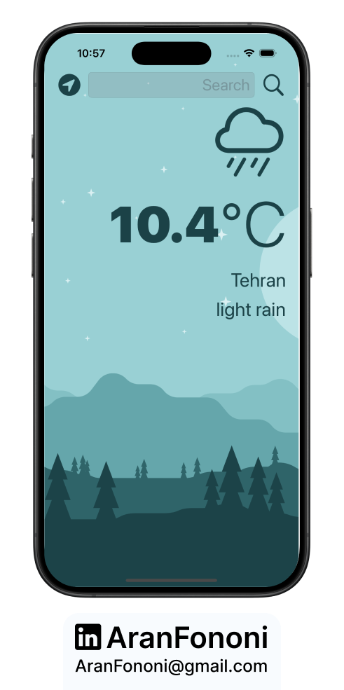
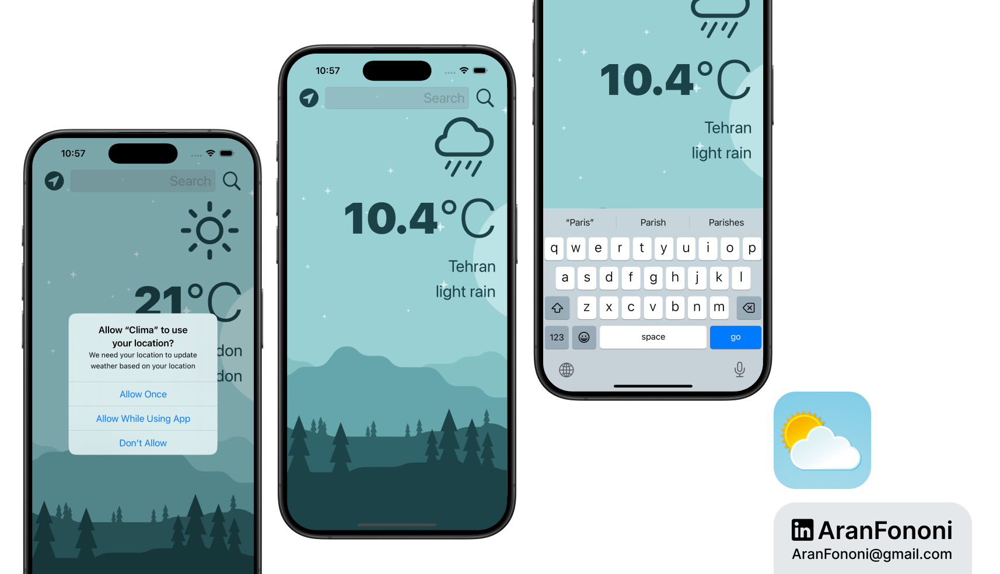

# Clima

### Project for Section 13: **Weather App using Core Location and API**  
This project was completed as part of Section 13 in the **Complete iOS Development Bootcamp** by Angela Yu.

## Project Overview
The **Clima** app provides users with real-time weather updates based on their current location or a city name entered into the search field. The app utilizes Core Location to fetch location data and communicates with the OpenWeatherMap API to retrieve weather information.

## What I Learned
In this project, I focused on:
- **Core Location Framework**: Implemented location services to fetch the user's current geographical coordinates.
- **Networking with URLSession**: Learned to perform network requests to an external API and parse JSON data.
- **Delegate Pattern**: Used protocols and delegates to handle asynchronous data updates from the weather manager.

## Key Skills
- Proficiency in Core Location for geolocation services
- Handling network requests and JSON parsing with URLSession
- Effective use of the delegate pattern for data communication

## Additional Features
The app supports both location-based weather fetching and manual city searches, providing flexibility for users. The weather information includes temperature, description, and appropriate weather icons based on conditions.

---

### Project Preview

---

### Footer

---

## Contact
For more information, feel free to reach out:  
- **Email**: [aranfononi@gmail.com](mailto:aranfononi@gmail.com)  
